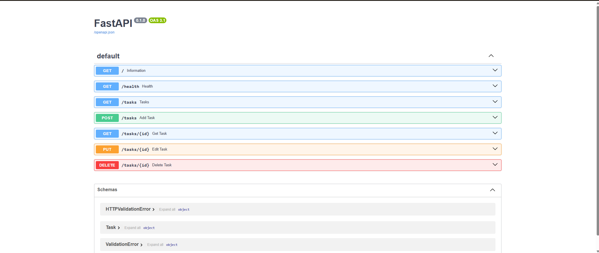

# FastAPI CRUD Task Manager API

A lightweight, in-memory CRUD (Create, Read, Update, Delete) API built with **Python 3.10+** and **FastAPI** as part of the **FlyRank Internship Homework (W2 · A1)**.

This API allows clients to manage a list of tasks. All task data is kept in-memory (losing data on server restart is by design for this stage of development). The API is interactive and fully documented out-of-the-box using Swagger UI.

---

## Features

- **Full CRUD operations** on a list of tasks (Create, Read, Update, Delete).
- **Automated interactive documentation** with Swagger UI.
- **Input validation** and robust error handling using standard HTTP status codes:
  - `200 OK` for successful reads/updates.
  - `201 Created` for successful creation.
  - `204 No Content` for successful deletion.
  - `400 Bad Request` for invalid or missing request data.
  - `404 Not Found` for requests targeting non-existent tasks.

---

## Getting Started

### Prerequisites

- **Python 3.10+**
- **pip** (Python package installer)

### Installation

1. Clone the repository (if not already done):
   ```bash
   git clone <repo-url>
   cd "Your first Crud API"
   ```

2. Create and activate a virtual environment (optional but recommended):
   ```bash
   # On Windows (PowerShell)
   python -m venv venv
   .\venv\Scripts\Activate.ps1
   
   # On macOS/Linux
   python3 -m venv venv
   source venv/bin/activate
   ```

3. Install the dependencies:
   ```bash
   pip install -r my_work/requirements.txt
   ```

### Running the Server

Start the FastAPI application on localhost using **uvicorn**:

```bash
uvicorn my_work.main:app --reload
```

The server will start running at **`http://127.0.0.1:8000`** (or `http://localhost:8000`).

---

## API Endpoints

| HTTP Method | Path | Description | Expected Payload (JSON) | Success Status | Error Statuses |
| :--- | :--- | :--- | :--- | :---: | :---: |
| **GET** | `/` | Describe the API | *None* | `200 OK` | - |
| **GET** | `/health` | Server health check | *None* | `200 OK` | - |
| **GET** | `/tasks` | List all tasks | *None* | `200 OK` | - |
| **GET** | `/tasks/{id}` | Get a single task by ID | *None* | `200 OK` | `404 Not Found` |
| **POST** | `/tasks` | Create a new task | `{"title": "Buy milk"}` | `201 Created` | `400 Bad Request` |
| **PUT** | `/tasks/{id}` | Replace/update a task | `{"title": "Buy milk", "done": true}` | `200 OK` | `400 Bad Request`, `404 Not Found` |
| **DELETE** | `/tasks/{id}` | Delete a task | *None* | `204 No Content` | `404 Not Found` |
| **POST** | `/reset` | Reset tasks to default | *None* | `200 OK` | - |

---

## Example Usage (curl)

### Health Check

```bash
curl -i http://localhost:8000/health
```

**Response:**
```http
HTTP/1.1 200 OK
date: Thu, 16 Jul 2026 21:00:00 GMT
server: uvicorn
content-length: 17
content-type: application/json

{"status":"ok"}
```

### Create a Task

```bash
curl -i -X POST http://localhost:8000/tasks -H "Content-Type: application/json" -d "{\"title\":\"Buy milk\"}"
```

**Response:**
```http
HTTP/1.1 201 Created
date: Thu, 16 Jul 2026 21:05:00 GMT
server: uvicorn
content-length: 37
content-type: application/json

{"id":4,"title":"Buy milk","done":false}
```


---

## Interactive Documentation (Swagger UI)

FastAPI automatically generates documentation for the API. Once the server is running, open your browser and navigate to:

👉 **`http://localhost:8000/docs`**

Here you can view all endpoints and use the **"Try it out"** button to perform the full CRUD cycle directly from your browser.

### Swagger UI Preview


---

## The Mortality Experiment (RAM Memory Volatility)

When we create new tasks through the API and then restart the server, performing a `GET /tasks` request reveals that all custom tasks have disappeared, resetting the list to its initial state. This occurs because the application's state is stored in the server's RAM (volatile memory), which is completely wiped when the process terminates. This behavior highlights the need for persistent storage (such as a database or filesystem), which is the entire reason Week 3 exists.

## AI vs Me

**Prompt used:** Asked Claude (Opus 4.6) to build the same CRUD todo API in Python/FastAPI, 
in-memory storage only, with filtering, search, a stats endpoint, and seed/reset restoring 
3 example tasks — generated in an isolated `ai_version/` folder without access to my own code.

**What the AI did better:**
- Split the code into three files (`main.py`, `models.py`, `store.py`), cleanly separating 
  routing, schemas, and data storage — a more maintainable structure than my single-file approach.
- Used Pydantic `Field(...)` constraints for declarative validation instead of manual `if` checks.
- Extended search to also match task descriptions, and made it case-insensitive.

**What it got wrong or quietly changed:**
- I never specified the exact shape of a `Task`. The AI replaced my simple `done: bool` with a 
  `status` enum (`open`/`done`) and added a `description` field I never asked for — meaning its 
  API isn't a drop-in replacement for mine (`{"title": "x", "done": false}` wouldn't work against it).
- Pydantic validation errors return **422**, not the **400** the assignment requires for a 
  missing/empty title — I didn't specify a status code, so the AI defaulted to FastAPI's built-in behavior.
- The DELETE endpoint returns the deleted task in the body alongside (implicitly) a non-204 
  response model, instead of an empty body — inconsistent with the "204 = no content" rule.
- It used `/tasks/reset` and `/tasks/seed` instead of the plain `/reset` I had in mind, and used 
  the now-deprecated `@app.on_event("startup")` instead of the newer `lifespan` pattern.

**What my prompt forgot to specify:**
- The exact field names/types for a task (`id`, `title`, `done`) — I only said "create, read, 
  update, delete tasks," leaving the AI free to redesign the data model.
- The exact status codes expected for validation errors (400) and delete responses (204, empty body).
- The exact route names for reset/seed and query parameter names for filtering.

**Takeaway:** the AI produced a well-structured, arguably more "professional" API, but several 
details drifted from my actual spec — because my prompt described the *behavior* I wanted, not 
the exact *contract* (fields, status codes, paths). I could only catch these gaps because I had 
built the assignment by hand first and knew exactly what "correct" was supposed to look like.
